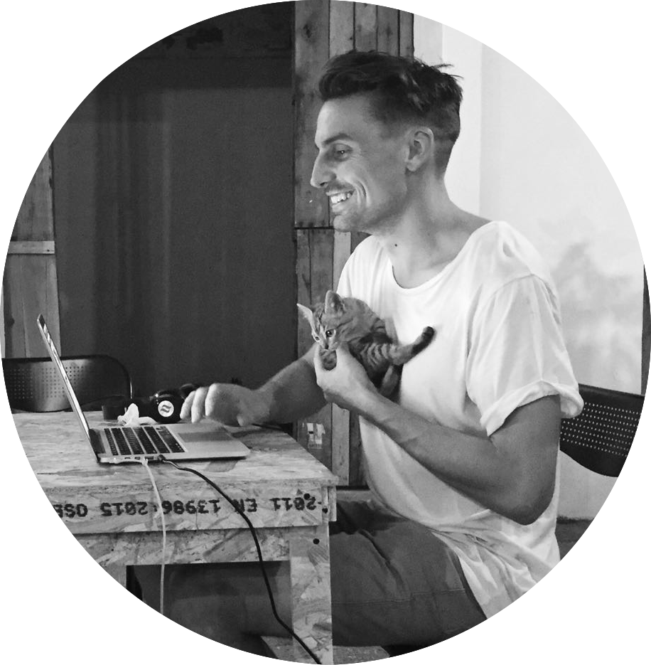

```{r, set-options, echo = FALSE, cache = FALSE}
knitr::opts_chunk$set(
 eval = T, # run all code
 echo = F, # show code chunks in output 
 tidy=T, # make output as tidy
 message = F,  # mask all messages
 warning = F, # mask all warnings 
 out.width="100%",
 size="small", # set code chunk size, 
 knitr::opts_chunk$set(fig.pos = 'H')
)
# options(width = 2000)
# get device output size
# dev.size("px")
```

<!-- install packages -->
```{r, load packages, include=T, cache=F, message=F, warning=F, results='hide',echo=F}
packages <- c("ggplot2","dplyr","tidyverse","zoo","RColorBrewer","viridis","plyr","leaflet","plotly","widgetframe","geosphere","lubridate","ggthemes","gridExtra","crosstalk")  
if (require(packages)) {
    install.packages(packages,dependencies = T)
    require(packages)
}
suppressPackageStartupMessages(
  lapply(packages,library,character.only=T) 
)

# update packages 
# update.packages(ask = FALSE, checkBuilt = TRUE)

require(RCurl)
require(RColorBrewer)
require(dplyr)
require(plotly)
script <- getURL("https://raw.githubusercontent.com/darwinanddavis/plot_it/master/plot_it.R", ssl.verifypeer = FALSE)
  eval(parse(text = script))
  # Set global plotting parameters
  cat("plot_it( \n0 for presentation, 1 for manuscript, \nset colour for background, \nset colour palette 1. use 'display.brewer.all()', \nset colour palette 2. use 'display.brewer.all()', \nset alpha for colour transperancy, \nset font style \n)")
  plot_it(0,"blue","Set3","Spectral",0.8,"") # set plot function params       
  plot_it_gg("black","white") # same as above for ggplot 

```


<!-- ____________________________________________________________________________ -->
<!-- start body -->

<div style="font-size:3em;"> Matt Malishev </div>

<div style="font-size:2em; color: #2A33AE;"> A biosketch </div>



<br>
<br>
<br>

<p style="font-size: 0.5em;">
Best viewed in Chrome  
Press `F` for fullscreen   
</p>

---  

## What interested you in this position? {data-background="img/sd.png" data-background-position="60% 90%" data-background-size="30%" data-background-repeat="no-repeat"} 

<br>

Data Storyteller plays to my strengths of transforming research, analysis, and writing into something relatable. Conceiving a novel idea, maturing it with data to make it falsifiable, then weaving this into a narrative is my creative vehicle to turn raw numbers or screen pixels into a compelling story.    

---

## Why /Data? {data-background="img/sd2.png" data-background-position="90% 20%" data-background-size="40%" data-background-repeat="no-repeat"}  

<br>

I make data-driven tools for better decision making and to push knowledge boundaries. It’s rewarding because few people can do what I do. However, it lacks tangible client and product focus and there are more applied opportunities to focus my output using diverse collaborative energy to reach more people. 

/Data is people-focused on everyday products with wide collaborative capacity in a data sandbox. This is an opportunity goldmine to sell creative data stories.

---  

## What sets you apart from the rest?

<br>

Perhaps best described by a now friend who summarised their initial thoughts about me after we first met, verbatim.  

<br> 

> Contrarian is an understatement. You use elevated language and eloquence to take charge of a conversation and hold presence in a particular space. Once you figure out what you want, you go for it.

---  

## My favourite /Data team value {data-background="img/sd3.png" data-background-position="80% 50%" data-background-size="40%" data-background-repeat="no-repeat"}  

<br> 

#### Attention to detail

My day-to-day is foraging in messy data to find patterns and running numbers through analyses to make something useful out of nothing remarkable. This makes attention to detail a critical and consistent element in my life.  

<br>

My 10 years experience as a freelance copy-editor also helps with this consistency.  

---  

## Tell us something you are most proud of in your life {data-background="img/pm.jpg" data-background-position="10% 30%" data-background-size="30%" data-background-repeat="no-repeat"}  

<br>

After giving a seminar at the International Society for Conservation Biology annual meeting in Colombia, I skipped my return flight to Australia and instead stayed for six months.      

<br> 

Deciding to abandon safe and comfortable for foreign and enlightening was one of my most valued life decisions. I ended up submitting my PhD thesis from a hammock in Medellin.     

--- 

## Book recommendation {data-background="img/rf.jpeg" data-background-position="80% 50%" data-background-size="30%" data-background-repeat="no-repeat"}

<br>

[_‘Surely you’re joking, Mr Feynman’_](https://www.amazon.com/Surely-Feynman-Adventures-Curious-Character/dp/0393316041), by theoretical physicist, Nobel Laureate, science communicator, and author Richard P. Feynman.   

From playing bongos in his spare time to pioneering research that led to the Manhattan Project, his charm and achievements were almost as incredible as his uncanny ability to teach quantum mechanics to a 6-year-old. You don’t need to be into science to appreciate this autobiography; his childlike curiosity inspires you to continuously learn and seek patterns and pleasures in the smallest things in life.  

---  

## Salary expectations  

<br> 
<br> 

Commensurate on my experience, my expected negotiable salary is $75K-$85K

---

## Links to published works  

#### Research articles  

<div class="small"> 
If links don't load, open in new window or search for title online.   

**Malishev M** & Civitello DJ (2019) Linking bioenergetics and parasite transmission models suggests mismatch between snail host density and production of human schistosomes. Integrative and Comparative Biology, iz385, [doi.org/10.1093/icb/icz058](https://academic.oup.com/icb/advance-article-abstract/doi/10.1093/icb/icz058/5497795?redirectedFrom=fulltext).      

Kearney MR, Munns SL, Moore D, **Malishev M** & Bull CM (2018) Field tests of a general ectotherm niche model show how water can limit lizard activity and distribution. Ecological Monographs. 88(4): 672–693, [doi.org/10.1002/ecm.1326](https://esajournals.onlinelibrary.wiley.com/doi/10.1002/ecm.1326).             

**Malishev M**, Bull CM & Kearney MR (2018) An individual-based model of ectotherm movement integrating metabolic and microclimatic constraints. Methods in Ecology and Evolution. 9(3): 472–489, [doi.org/10.1111/2041-210X.12909](https://besjournals.onlinelibrary.wiley.com/doi/full/10.1111/2041-210X.12909).        

Fraser H, Soanes K, Jones C, Jones S & **Malishev M** (2017) The value of virtual conferencing for ecology and conservation. Conservation Biology. 31(3): 540–546, [doi.org/10.1111/cobi.12837](https://www.ncbi.nlm.nih.gov/pubmed/27624673).  

Sperfeld E, Wagner ND, Halvorson HM, **Malishev M** & Raubenheimer D (2017) Bridging Ecological Stoichiometry and Nutritional Geometry with homeostasis concepts and integrative models of organism nutrition. Functional Ecology. 31(2): 286–296, [doi.org/10.1111/1365-2435.12707](https://besjournals.onlinelibrary.wiley.com/doi/10.1111/1365-2435.12707).       

Sperfeld E, Halvorson HM, **Malishev M**, Clissold F & Wagner ND (2016) Woodstoich III: Integrating tools of Nutritional Geometry and Ecological Stoichiometry to advance element budgeting and the prediction of consumer-driven nutrient recycling. Oikos. 125: 1539–1553, [doi.org/10.1111/oik.03529](https://onlinelibrary.wiley.com/doi/full/10.1111/oik.03529).     

**Malishev M** & Sanson GD (2015) Leaf mechanics and herbivory defence: how tough tissue along the leaf body deters growing insect herbivores. Austral Ecology, 40: 300–308, [doi:10.1111/aec.12214](https://onlinelibrary.wiley.com/doi/pdf/10.1111/aec.12214).      

</div>

---  

<br> 

#### Book chapters

<div class="small">

Complete book found at [Uni-Edit press](http://uni-edit.press/en/).     

**Malishev M** (2017) How to Master Punctuation in Academic English Writing? In How to Fix your Academic English and Publish your Research Faster. Eds. Ozy Abram et al. [Amazon link](https://www.amazon.com/dp/B078H5P4Y7).      

**Malishev M** (2017) The Secrets to Selecting a Target Journal and Publishing Faster. ——— [Amazon Link](https://www.amazon.com/dp/B078H278VZ).      

**Malishev M** (2017) Insider Info on Editing, Writing, and Publishing your Research. ——— [Amazon link](https://www.amazon.com/dp/B078HCP3LY).      

</div>

<br> 

#### Some selected digital marketing blog posts  


<div class="small">

Tycho blissfully melts eardrums and warps perception at 170 Russell. [The Plus Ones, Jan 27, 2017](https://theplusones.com/melbourne/2017/01/27/tycho-band-electro-chillwave-techno-music-170-russell/).

Milk is the right choice: Anchor Milk Sensory Milk Flight at Milk the Cow. [The Plus Ones, March 9, 2016](https://theplusones.com/melbourne/2016/03/09/anchor-milk-sensory-milk-flight-at-milk-the-cow/).  

When experimental sound meets electro meets war-torn Kuwait: Fatima Al Qadiri gig at Howler. [The Plus Ones, June 20, 2016](https://theplusones.com/melbourne/2016/06/20/fatima-al-qadiri-gig-howler-brunswick/).     

</div>


  


